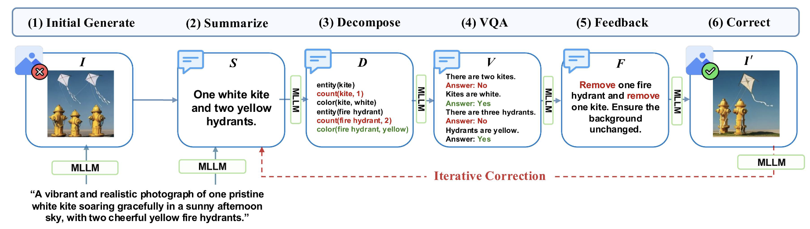
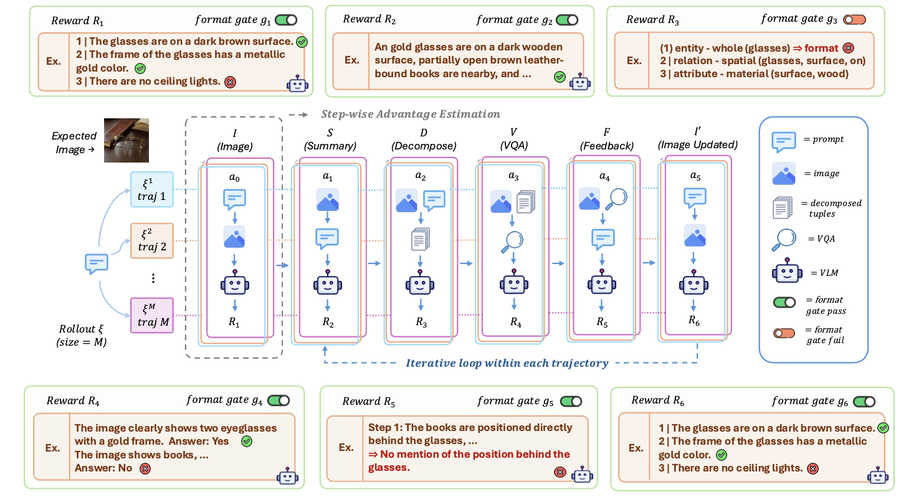
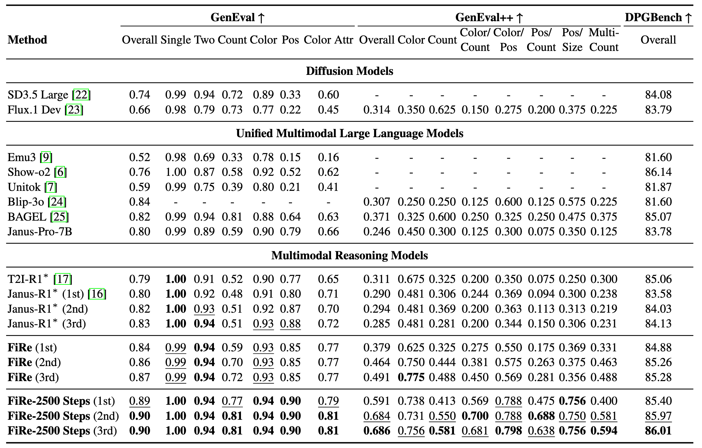
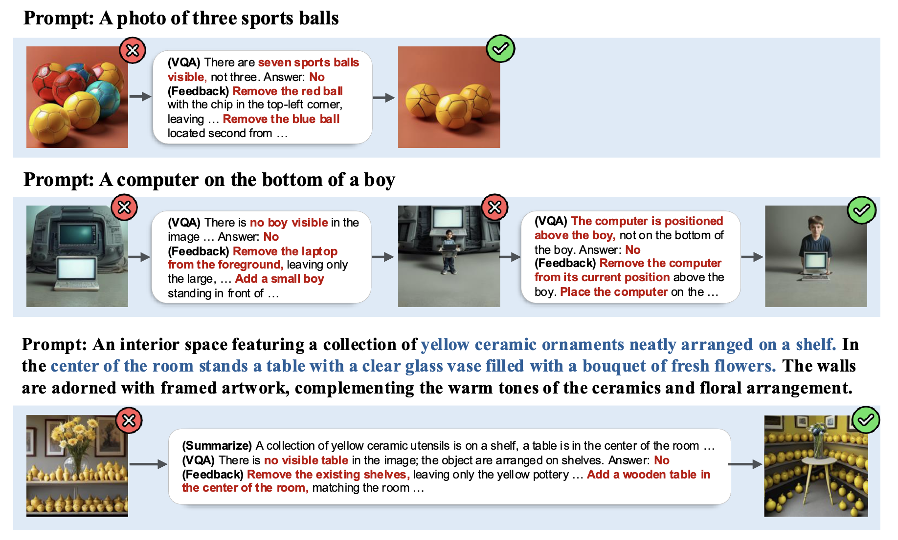

<div align="center">

# 🔥 FiRe: Fine-grained Multimodal Reasoning for Enhanced Image Generation

<a href="https://arxiv.org/pdf/2604.13491v3" target="_blank"></a>
<a href="https://ku-agi.github.io/FiRe/" target="_blank"></a>
<a href="https://github.com/KU-AGI/FiRe" target="_blank"></a>
<a href="https://huggingface.co/KU-AGI/FiRe-300Step" target="_blank"></a>
<a href="https://huggingface.co/KU-AGI/FiRe-2500Step" target="_blank"></a>
<a href="https://huggingface.co/KU-AGI/FiRe-SFT" target="_blank"></a>

**Official implementation of FiRe: Fine-grained Multimodal Reasoning for Enhanced Image Generation**

🔥 FiRe has been accepted to **NeurIPS 2026**! 🔥

</div>

<div align="center">

### FiRe Inference


### FiRe-GRPO


</div>

# 📋 TODO
- [x] Paper release
- [x] Model checkpoint release
- [x] Release inference code
- [ ] Release training code

# 📌 Paper Overview
Unified MLLMs can both understand and generate images, but their reasoning ability is rarely used to improve generation itself. Existing reasoning-based text-to-image methods rely on prompt augmentation or holistic image–text judgments, so they often miss fine-grained details such as attributes, counts, and spatial relations.

**FiRe** breaks the prompt into verifiable visual requirements, checks each one against the generated image, and corrects only the parts that are wrong. Concretely, it summarizes the prompt into verifiable visual details, decomposes them into atomic semantic tuples (objects, attributes, counts, spatial relations), verifies each tuple against the image with tuple-level VQA, and turns any unsatisfied tuple into an explicit correction instruction — which is then applied through localized image editing that fixes only the mismatched regions while preserving everything already correct.

We also propose **FiRe-GRPO**, a step-level reinforcement learning method that gives each reasoning step its own reward. Standard GRPO assigns a single, trajectory-level reward to the whole reasoning-and-generation rollout, so every step — whether it was the tuple decomposition, the VQA verification, or the final edit — gets the same credit regardless of which step actually caused the outcome, making it hard to tell which reasoning step to reinforce and which to discourage. FiRe-GRPO instead assigns step-specific rewards and estimates the advantage of each step separately within the same trajectory, then optimizes the policy with GRPO — enabling precise, step-level credit assignment and yielding better fine-grained image-prompt alignment.

# 📊 Results

### Quantitative Results
<div align="center">

</div>

**FiRe** is the checkpoint used in the NeurIPS 2026 paper, trained for 300 steps. We additionally report **FiRe-2500 Steps**, obtained by continuing the same FiRe-GRPO training to 2,500 steps.

### Qualitative Results
<div align="center">

</div>


# 🐍 Environments

```bash
conda create -n fire python=3.10 -y
conda activate fire
pip install -r requirements.txt
```

> **Note:** `flash_attn` requires a matching CUDA toolkit. If the above fails on `flash_attn`, install it separately:
> ```bash
> pip install flash-attn --no-build-isolation
> ```

# 🧠 Inference

## 1. Clone Benchmark Repositories

Each benchmark must be cloned separately. Update the paths in `configs/dataset/eval.yaml` to match your local setup.

**GenEval**
```bash
git clone https://github.com/djghosh13/geneval /path/to/geneval
```

**DPG-Bench** (part of the ELLA repository)
```bash
git clone https://github.com/TencentQQGYLab/ELLA /path/to/ELLA
```

**T2I-CompBench**
```bash
git clone https://github.com/Karine-Huang/T2I-CompBench /path/to/T2I-CompBench
```

Then edit `configs/dataset/eval.yaml`:
```yaml
geneval: /path/to/geneval/prompts/evaluation_metadata.jsonl
t2icompbench: /path/to/T2I-CompBench/examples/dataset
dpgbench: /path/to/ELLA/dpg_bench/prompts
```

## 2. Download Model Checkpoint

**FiRe_300Step** is the checkpoint used in the NeurIPS 2026 paper. `FiRe_2500Step` continues the same FiRe-GRPO training to 2,500 steps, and `FiRe_SFT` is the supervised fine-tuning checkpoint before FiRe-GRPO training.

```bash
hf download KU-AGI/FiRe-300Step --local-dir ./checkpoints/FiRe-300Step
```

## 3. Run Inference

Edit the variables at the top of each script (`CKPT_PATH`, `SAVE_PATH`, `EXP_NAME`, `WORLD_SIZE`, `BATCH_SIZE`) to match your setup, then run from the project root:

**GenEval**
```bash
bash scripts/eval/run_geneval.sh
```

**DPG-Bench**
```bash
bash scripts/eval/run_dpgbench.sh
```

**T2I-CompBench**
```bash
bash scripts/eval/run_t2icompbench.sh
```

Generated images are saved to `<SAVE_PATH>/<EXP_NAME>/<task_name>/`.

### Self-Correction Options

| Option | Description |
|---|---|
| `use_self_correction` | Whether to run the self-correction loop after initial generation. If `True`, the model generates an image, reasons over it with VQA, produces corrective feedback, and edits the image — repeating up to `max_correction_steps` times. If `False`, only the initial generation (`gen/`) is produced. |
| `max_correction_steps` | Maximum number of correction iterations. A value of `N` produces stages `gen/`, `correction_0/`, ..., `correction_{N-1}/`. Corrects early if VQA determines the image already satisfies the prompt. |


# 🤗 Acknowledgment

We sincerely thank the authors of [Janus-Series](https://github.com/deepseek-ai/janus) and [Janus-Pro-R1](https://github.com/wendell0218/Janus-Pro-R1?tab=readme-ov-file) for making their models and code publicly available.

# 📝 Citation
```bibtex
@article{kim2026fire,
  title={FiRe: Fine-grained Multimodal Reasoning for Enhanced Image Generation},
  author={Kim, Yongjin and Oh, Yoonjin and Kim, Yerin and Kim, Hyomin and Yun, Jeeyoung and Heo, Yujung and Kim, Minjun and Kim, Sungwoong},
  journal={arXiv preprint arXiv:2604.13491},
  year={2026}
}
